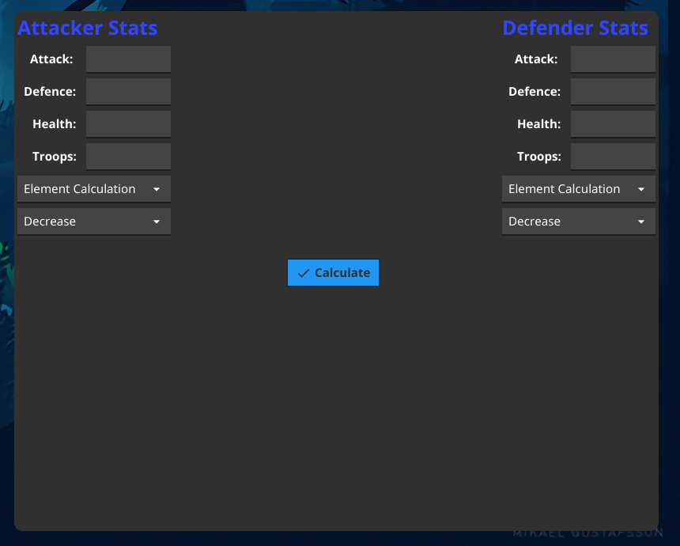

# VikingsStatsCalc
Emulate a Vikings War of Clans battle with the real game mechanics and gives you the results of your emulated rapport!

# Installation
There are two roads:
1. Compile it
2. Download binary files  

If you chose manually compile project, enter in the main directory then run these commands:
```
go build .
go run .
```
# Showcase 
<p align="center" markdown="1" style="max-width: >
  
</p>


# TODO
- ~~Introduce saturation mechanic~~ - **Done**
- ~~Introduce losses count~~ - **Done**
- Introduce decrease mechanic - Almost Done
- Instead of Element Calculation introduce Tier->Boosts mechanics

# Contributors
_Developed with my man @PixelGodV3_
_Huge thanks to @DumbMahreeo for the contribution :)_
